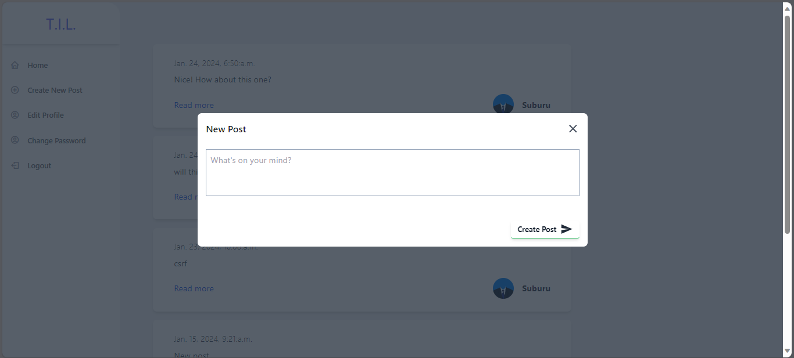

# Django-201

This is a project for Django 201 section in "The Ultimate 2023 Fullstack Web Development Bootcamp" in Udemy. It is built with Tailwind

* [Screenshot](##screenshots)

## Screenshots

*Login page*
---

*Sign up Page*
---

*Homepage*
---

*Creating New Post*
---

*Viewing and Editing Profile Button*
---

*Editing Profile*
---

*Forgot Password before and after of logging in*

